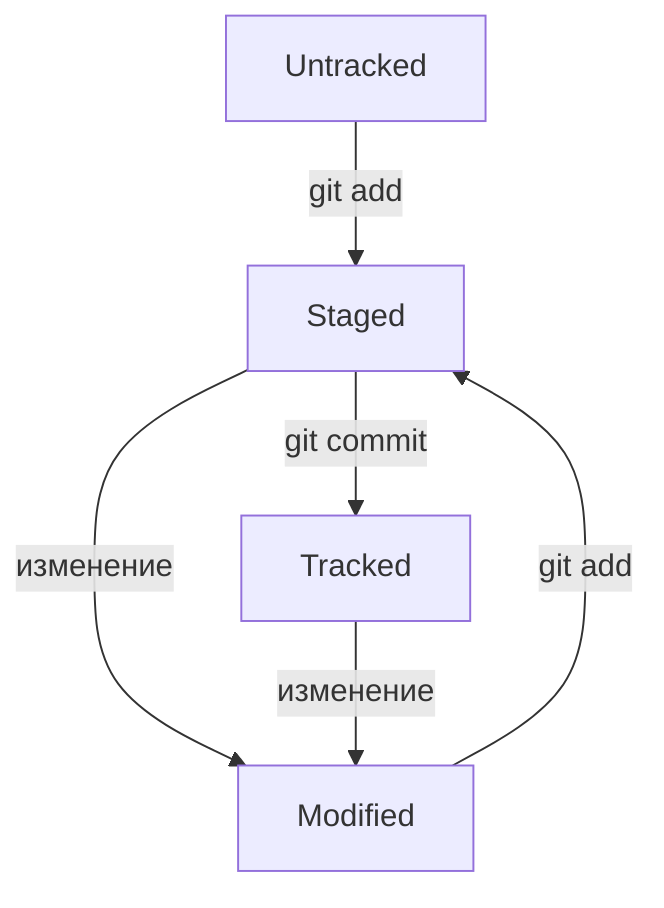

# О проекте
Это учебный проект - Домашнее задание по курсу обучения по git от yandex education.
[Ссылка на курс](https://practicum.yandex.ru/profile/git-basics/)
Пример файла .md в репозитарии github c краткой шпаргалкой по типовым операциям 
# Шпаргалка по GIT
## Общие сведения
**GIT** –система контроля версий с активной поддержкой и открытым исходным кодом. Консольное приложение GitBrush позволяет работать с локальными репозиториями (хранилищами файлов) и синхронизировать их с облачными репозиториями.
Подробнее:  
[Книжка по Git](https://git-scm.com/book/ru/v2)

**GITHUB** – облачное решение от Microsoft для контроля версий с хранением репозиториев в облаке. Это облачная платформа где программисты могут хранить свои проекты, контролировать их версии и публиковать их.  
[Ссылка на GitHub](https://github.com/)

## Начало работы с Git:
1. Скачать и поставить дистрибутив под нужную ОС:  
https://git-scm.com/download/

## Создать локальный репозитарий (на примере простейшего проекта с одним файлом): 
1. Запустить GitBrush
2. Переходим в домашний каталог  
cd  ~
3. Создаем папку для своих локальных проектов git в домашнем каталоге:  
mkdir git
4. Создаем папку проекта:  
mkdir ~\git\testprogect
5. Заходим в папку проекта  
cd ~\git\testprogect
6. Создаем пустой файл с описанием проекта:  
touch readme.md
7. Инициализируем локальный репозитарий git:  
git init
8. Проверяем, что в папке проекта появилась папка репозитрия .git  
ls –al
9. Проверяем статус репозитария  
git status
10. Добавляем все файлы из текущей папки к коммиту (можно добалять все –all или отдельные файла по именам). Далее в рамках коммита будет зафиксирвоана версия добавленных файлов  
git add .
11. Выполняем коммит (фиксируем состояние добавленных файлов, чтобы впоследствии контролировать внесенные в них изменения). К каждому коммиту (слепку, состоянию) можно добавлятькомментарий  
git commit -m "Пустой репозиторий"

## Настройка GitHub и синхронизация с локальным репозитарием
1. Заходим на github и создаем аккаунт, набор ключей доступа и репозитарий для нашего проекта по документации:  
[Быстрый старт по GitHub](https://docs.github.com/ru/get-started/quickstart)
2. В разделе "Quick setup — if you’ve done this kind of thing before" созданного репозитария копируем путь к репозитарию и связываем локальный репозитарий с созданным репозитарием на github:  
git remote add origin <сюда вставить путь к репозитория>
3. Проверить репозитарий:  
git remote –v
4. Передать локальный репозитарий на GitHub (ключ –u и название origin и ветки master нужно только первый раз):  
git push -u origin master
5. В любом текстовом редакторе заполняем файл readme.md используя разметку MarkDown, описание разметки здесь:  
https://gist.github.com/fomvasss/8dd8cd7f88c67a4e3727f9d39224a84c
Описание способа оформления графических даграмм в разметке здесь:
https://github.blog/2022-02-14-include-diagrams-markdown-files-mermaid/
6. Добаить измененный файл к коммиту  
git add readme.md
7. Коммит репозитария  
git commit -m "V1 readme.md – ВВЕДЕН ТЕКСТ" 
8. Отпраить на GitHub обновленную версию репозитария  
git push
9. Проверить результат на GITHUB  
## Команда git log
1. Выаод лога коппитов. Каждый комминт снабжен хэшем
git log
Для выхода из лога - нажать q
2. Вывод лога в сокращенном виде
git log --oneline
3. В логе HEAT - это последний коомит. В папке .git есть файл HEAT который ссылается на хэш последнего коммита
## Жизненный цикл файла в git
1. Статусом untracked помечается файл, о существовании которого Git знает, но не следит за изменениями в нём. Этот статус — противоположность tracked, в который попадают все файлы, отслеживаемые Git.
Файл переходит в статус staged после выполнения git add.
2. Статус modified означает, что файл был изменён.
3. Большинство файлов в проектах «шагает» по следующему циклу: «изменён» → «добавлен в список на коммит» → «закоммичен» → «изменён» → и так далее.
4. Схема жизненного цикла файла в GIT:

## Команда git status
1. Команда git status всегда подскажет, что происходит с файлом: например, он добавлен в с1/писок «на коммит» или ещё вообще не отслеживается, или изменён.
2. git status показывает явно следующие состояния файлов: untracked, staged и modified.
3. git status подсказывает, какие команды можно выполнить, чтобы поменять состояние файла.
## Правила оформления коммитов к версиям
1. Стандарт описания коммитов здесь: https://www.conventionalcommits.org/ru/v1.0.0-beta.4/#спецификация
2. Основные правила оформления коммитов:
- сообщение коммита легко читается;
- оно информативное;
- все сообщения оформлены в одном стиле;
- длина коммита до 72 символов
- если коммит ссылается на задачу в GitHubm, о вставить ссылку на задачу в формате "#номер задачи"
## Редактирование последнего коммита с опцией --amend
1. --amend рассчитан на работу с последним коммитом (HEAD).
2. Дополнить коммит новыми файлами можно с помощью git commit --amend --no-edit. Благодаря опции --no-edit сообщение к коммиту останется таким, каким и было.
3. Изменить сообщение к коммиту позволяет команда git commit --amend -m "Обновлённое сообщение коммита".
## Редакторы VIM и nano
1. Описание редактора nano https://help.ubuntu.ru/wiki/nano
2. Для запука обучалки по VIM набрать vimtutor
3. Основные команды VIM: ESC - выход в командный режим, i - вставка текста, А - добавление текста, x - удаление текста, h,j,k,l - перемещение курсора, :wq - сохранить и выйти.
## Откат к коммиту или откат изменений файла
1. Команда git restore --staged \<file\> переведёт файл из staged обратно в modified или untracked.
2. Команда git reset --hard \<commit hash\> «откатит» историю до коммита с хешем <hash>. Более поздние коммиты потеряются!
3. Команда git restore \<file\> «откатит» изменения в файле до последней сохранённой (в коммите или в staging) версии.
## Показать изменения файла
1. Команда git diff сравнит последнюю закоммиченную версию файла с той, что находится в состоянии modified. git diff показывает изменения, которые не были добавлены в staged.
Посмотреть изменения с помощью git diff можно, только если они не были проиндексированы или закоммичены.
2. Команда git diff --staged покажет изменения в staged-файлах относительно последних закоммиченных версий
3. git diff a9928ab 11bada1 покажет различия коммитов с хешами a9928ab и 11bada1
## Игнорирование файлов в GIT
1. Список файлов/папок для игнорирования в GIT внести в файл .gitignore и добавить данный файл в commit
2. Синтаксиси файлв .gitignore
- \# - комминт
- filename - игнорировать файл с таким именем в текущей папке и всех подпапках
- \* - соответсвует любой сроке. Например *.log - игнорировать все локи во всех папках проекта
- doc/\*/\*.log - игнорировать все логи во всех подпапках папки doc
- ? - заменяем 1 символ. Пример file?.txt, игнорировать file1.txt, file2.txt, но не игнорировать file12.txt
- [..] - один символ из лиапазона. Например file[1-5].txt - игнорировать file1.txt, но не игнорировать file6.txt. Диапазаоны: [abc], [a-z] и т.д.
- / - указывает на каталог /file.txt -  игнорировать файл в корневом каталоге, без / - игнорировать во всех каталогах, dir/ - игнорировать папку dir/
- \*\* - указывает на любую папку, включая 0 папок. Пример:

	игнорировать файлы "docs/current/tmp", "docs/old/tmp", а также "docs/old/saved/a/b/c/d/tmp"	и даже "docs/tmp", потому что ноль вложенных папок тоже подходит
		docs/\*\*/tmp	
	игнорировать только "docs/current/tmp" и "docs/old/tmp" файл "docs/old/saved/a/b/c/d/tmp" не попадает в правило
		docs/\*/tmp 
- ! - инверсия условия, например:
	
	\*.txt
	!file1.txt
	
	будут игнорироваться все текстовые файлы, кроме file1.txt
	
3. Команда git status не отображает игнорируемые файлы
4. Команда git status --ignored показывает игнорируемые файлы в разделе Ignored files
## Клонирование репозиотрия
1. На стороне GitHub открыть проект, нажать кнопку <>Code и на вкладке SSH скоприровать ссылку для клонирования проекта, например git@github.com:yandex-praktikum/git-clone-practice.git
2. В локальном репозитарии:
	git clone git@github.com:yandex-praktikum/git-clone-practice.git
3. Проект клонируется на локальный диск и локальная копия связывается с удаленным репозиторием
4. Для проверки статуса клонированного проекта перейти в папку с отклонированным проектом и:
	git remote -v
	

